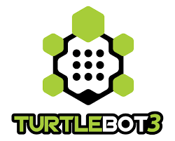

<h4 align="center">
    <br> 
</h4>

<h4 align="center">
    LQR Nav2 Controller Plugin
</h4>

<p align="center">
    <a href="#description">Description</a> •
    <a href="#team">Team Members</a> •
    <a href="#how-lqr-works">LQR Algorithm</a> •
    <a href="#architecture-overview">Architecture</a> •
    <a href="#project-structure"> Structure </a>
    <br>
    <a href="#getting-started"> Setup</a> •
    <a href="#running-the-simulation">Run Simulation</a> •
    <a href="#benchmark">Benchmark</a> •
    <a href="#reference">Reference</a>
</p>

## Description

A custom Nav2 controller plugin implementing an LQR (Linear Quadratic Regulator) path-tracking controller for ROS2 Humble. Built for CMPT 419/720 at SFU.

The controller linearizes unicycle dynamics in body-frame coordinates, solves the Discrete Algebraic Riccati Equation (DARE) for steady-state gains, and produces smooth velocity commands to track a global path from Nav2's planner.

This project mainly used the Turtlebot 3 burger platform.

## Team

| Name | Email |
|------|-------|
| Tommy Oh | koa18@sfu.ca |
| Ansh Aggarwal* | aaa275@sfu.ca |
| Daniel Senteu | dms26@sfu.ca |
| JunHang Wu | jwa337@sfu.ca |

## How LQR Works

LQR (Linear Quadratic Regulator) finds the optimal velocity correction at each timestep by minimizing a cost that balances tracking accuracy against control effort — tuned via the `Q` and `R` weights in `nav2_params.yaml`.

### Body-Frame Tracking Error

Rather than computing error in the global frame, we project into the path's local coordinate frame so the cost function meaningfully separates lateral (cross-track) and longitudinal deviation:

$$e_{\text{long}} = \cos\theta_{\text{ref}}\,\Delta x + \sin\theta_{\text{ref}}\,\Delta y$$
$$e_{\text{lat}} = -\sin\theta_{\text{ref}}\,\Delta x + \cos\theta_{\text{ref}}\,\Delta y$$
$$e_{\theta} = \text{normalize}(\theta - \theta_{\text{ref}})$$

### Discrete Linearization

Linearizing around **e = 0** with $v_{\text{ref}} = 0.2$ m/s and $\Delta t = 0.05$ s:

$$A_d = \begin{bmatrix}1 & 0 & 0 \\ 0 & 1 & v_{\text{ref}}\Delta t \\ 0 & 0 & 1\end{bmatrix}, \quad B_d = \begin{bmatrix}\Delta t & 0 \\ 0 & 0 \\ 0 & \Delta t\end{bmatrix}$$

Because $v_{\text{ref}}$ and $\omega_{\text{ref}} = 0$ are constant, $A_d$ and $B_d$ are constant — DARE is solved *once* at startup, not every control cycle.

### Discrete Algebraic Ricatti Equation Solver

$$P_{k+1} = Q + A_d^\top P_k A_d - A_d^\top P_k B_d\bigl(R + B_d^\top P_k B_d\bigr)^{-1} B_d^\top P_k A_d$$

Converges when $\max|P_{k+1} - P_k| < 10^{-9}$, typically in under 100 iterations.

### Gain Computation & Control Law

$$K = \bigl(R + B_d^\top P B_d\bigr)^{-1} B_d^\top P A_d$$

$$\delta\mathbf{u} = -K\mathbf{e}, \qquad v = v_{\text{ref}} + \delta u_0, \qquad \omega = \delta u_1$$

Clamped to TurtleBot3 Burger limits: $v \in [0,\ 0.22]$ m/s, $\omega \in [-2.84,\ 2.84]$ rad/s.

## Architecture Overview

```
Nav2 Planner (NavFn)  -->  global path
        |
        v
Nav2 Controller Server  -->  loads LQRController plugin
        |
        v
LQRController.computeVelocityCommands()
   1. Find closest point on path
   2. Advance by lookahead distance
   3. Compute body-frame error (lqr_solver)
   4. Apply LQR gain: delta_u = -K * error
   5. v = v_ref + delta_v, omega = delta_omega
   6. Clamp to TurtleBot3 limits
        |
        v
/cmd_vel  -->  TurtleBot3 Burger
```

## Project Structure

```
LQR-Controller/
├── .devcontainer/                   # Dev Container Environment
│   ├── devcontainer.json
│   └── Dockerfile
├── .github/workflows                # GitHub Action Workflows to deploy website
│   └── deploy-pages.yml             
├── config/                          # Nav2 config folder 
│   ├── dwb_navfn_params.yaml
│   ├── dwb_smac_params.yaml
│   ├── lqr_navfn_params.yaml
│   ├── lqr_smac_params.yaml
│   ├── mppi_smac_params.yaml             
│   └── mppi_smac.yaml              
├── imgs/                            # Folder for images
├── output/                          # Folder that saves the output
├── recording/                       # Folder that rosbag recording
├── scripts/
│   ├── benchmark_analysis.py        # Rosbag metrics analysis
│   ├── fake_robot_node.py           # Fake robot node for headless testing environment
│   └── run_benchmarks.py            # Automated testing for rosbag runs
├── src/
│   ├──lqr_controller/               # ROS2 LQR C++ packages
│   │   ├── include/lqr_controller/
│   │   │   ├── lqr_controller.hpp   
│   │   │   └── lqr_solver.hpp       
│   │   ├── src/
│   │   │   ├── lqr_controller.cpp   
│   │   │   └── lqr_solver.cpp       
│   │   ├── CMakeLists.txt
│   │   ├── package.xml
│   │   └── lqr_controller_plugin.xml
│   ├──mppi_controller/              # ROS2 MPPI C++ package
│   │   ├── include/mppi_controller/
│   │   │   ├── lqr_controller.hpp   
│   │   │   └── lqr_solver.hpp       
│   │   ├── src/
│   │   │   ├── lqr_controller.cpp   
│   │   │   └── lqr_solver.cpp       
│   │   ├── CMakeLists.txt
│   │   ├── package.xml
│   │   └── lqr_controller_plugin.xml  
├── website/
│   ├── assets/                      # Asset folder
│   └── index.html                   # Our project website 
├── proposal.md                      # Project proposal
├── README.md                        # Project Description
├── ros_entrypoint.sh 
└── .gitignore                       
```

## Getting Started

### Prerequisites

- Docker + VS Code with Dev Containers extension
- **Windows:** WSL2 (for GUI / Gazebo display)
- **macOS:** XQuartz (for GUI / Gazebo display) — see [macOS Setup](#macos-setup) below

> [!WARNING]
> We do not recommend to setup this project in MacOSX because some of the packages are deprecated in ARM architecture. If you need to use MacOSX, we recommend you to use headless mode. 

> [!TIP]
> We recommend you to use AMD64 architecture and use Dev Container.

### 1. Open in Dev Container

```bash
git clone <repo-url>
code LQR-Controller/
```

**Windows:** When prompted "Reopen in Container", click **Yes**.
Or manually: `Ctrl+Shift+P` > `Dev Containers: Reopen in Container`

**macOS:** See [macOS Setup](#macos-setup) — you must switch to the Mac devcontainer config first.

First build takes ~5-10 min. Subsequent opens use Docker cache.

---

### macOS Setup

macOS requires XQuartz for GUI forwarding (Gazebo, RViz). The default `devcontainer.json` is WSL2-only and will not work on Mac.

**Step 1 — Install XQuartz**

```bash
brew install --cask xquartz
```

Then log out and log back in (required for XQuartz to register as the display server).

**Step 2 — Allow network connections in XQuartz**

Open XQuartz, go to **Preferences > Security**, and check:
- "Allow connections from network clients"

Then restart XQuartz.

**Step 3 — Allow localhost display access**

Run this in your terminal each time before opening the container:

```bash
xhost +localhost
```

**Step 4 — Switch to the Mac devcontainer config**

Copy the Mac config over the default before opening in VS Code:

```bash
cp .devcontainer/devcontainer.mac.json .devcontainer/devcontainer.json
```

> **Note:** Do not commit this change. The default `devcontainer.json` is for Windows/WSL2.

**Step 5 — Open in Dev Container**

```bash
code LQR-Controller/
```

`Cmd+Shift+P` > `Dev Containers: Reopen in Container`

---

### 2. Build

```bash
colcon build --symlink-install --packages-select lqr_controller
source install/setup.bash
```

### 3. Verify Plugin

```bash
ros2 plugin list | grep lqr
# Expected: lqr_controller/LQRController
```

## Running the Simulation

### LQR Controller

```bash
# Terminal 1: Gazebo + Nav2
export TURTLEBOT3_MODEL=burger
ros2 launch nav2_bringup tb3_simulation_launch.py \
    params_file:=$(pwd)/config/nav2_params.yaml \
    headless:=False

# Terminal 2 (optional): Send a goal via CLI instead of RViz
ros2 topic pub --once /goal_pose geometry_msgs/PoseStamped "{
  header: {frame_id: 'map'},
  pose: {position: {x: 2.0, y: 0.5, z: 0.0},
         orientation: {x: 0.0, y: 0.0, z: 0.0, w: 1.0}}
}"
```

> **Note:** The Dockerfile sets `TURTLEBOT3_MODEL=waffle` in `.bashrc`. The `export` above overrides it per-session. If you want `burger` permanently, edit `.bashrc` inside the container.

### Navigating with RViz

After launch, RViz opens alongside Gazebo. Navigation requires two steps:

**1. Set initial pose (required before any goal)**
- Click **"2D Pose Estimate"** in the RViz toolbar
- Click the map at the robot's starting location in Gazebo and drag to set heading
- Green particles appear around the robot — AMCL is now localized

**2. Send a navigation goal**
- Click **"Nav2 Goal"** in the RViz toolbar
- Click the destination on the map and drag to set goal orientation
- Nav2 plans a path (green line) and the robot begins moving

```
RViz toolbar:
[ 2D Pose Estimate ]  -->  initializes AMCL localization
[ Nav2 Goal ]         -->  sends goal to Nav2 BT navigator
```

> **Tip:** If the robot doesn't move after setting a goal, AMCL isn't localized — redo the 2D Pose Estimate step more precisely over the robot's actual Gazebo position.

> **Tip:** If Gazebo launched but the window is missing, run `gzclient` in a new terminal to attach the GUI to the running `gzserver`.

### DWB Controller (Baseline Comparison)

```bash
export TURTLEBOT3_MODEL=burger
ros2 launch nav2_bringup tb3_simulation_launch.py \
    params_file:=$(pwd)/config/dwb_params.yaml \
    headless:=False
```

## Configuration

LQR parameters are set in `config/nav2_params.yaml` under the `FollowPath` plugin:

| Parameter | Default | Description |
|-----------|---------|-------------|
| `desired_speed` | 0.2 | Reference velocity (m/s) |
| `lookahead_distance` | 0.5 | Path lookahead (m) |
| `q_longitudinal` | 1.0 | Along-track error weight |
| `q_lateral` | 3.0 | Cross-track error weight |
| `q_heading` | 1.0 | Heading error weight |
| `r_v` | 1.0 | Speed effort weight |
| `r_omega` | 0.5 | Turn effort weight |

## Benchmarking

### Record Data

Follow the previous steps to setup Gazebo and RViz, set initial pose.

Start recording:
```bash
# lqr recording
ros2 bag record -o recordings/lqr_run_1 /tf /tf_static /cmd_vel /plan /odom /amcl_pose

# dwb recording
ros2 bag record -o recordings/dwb_run_1 /tf /tf_static /cmd_vel /plan /odom /amcl_pose
```
**Note**: make sure to increment the run count.

Set a goal for the Turtlebot:
```bash
ros2 topic pub --once /goal_pose geometry_msgs/PoseStamped "{
  header: {frame_id: 'map'},
  pose: {position: {x: 2.0, y: 0.5, z: 0.0},
         orientation: {x: 0.0, y: 0.0, z: 0.0, w: 1.0}}
}"
```
After reaching the goal or done recording, `ctrl + c` to stop the recording (on the terminal that started the recording).

The benchmark can be run through the python script headless (meaning no frontend, only backend).
Run this python script to benchmark with each algorithm:
```bash
# first parameters will take integer how many tests do you want to run
# second parameters will be the time for timeout seconds
source install/setup.bash
python3 scripts/run_benchmarks.py --runs 3 --timeout 360
```

### Analyze

After running the benchmark, run this python script to analyze the benchmark:

```bash
python3 scripts/benchmark_analysis.py --bag recordings/lqr_run_1 --bag recordings/dwb_run_1
```
Outputs are saved in `output/run_<run_count>`

- Metrics: cross-track error, smoothness, time-to-goal, success rate.

## References

### Nav2 & ROS2

1. [Nav2 Writing a New Controller Plugin](https://docs.nav2.org/plugin_tutorials/docs/writing_new_nav2controller_plugin.html) — plugin interface, lifecycle methods, pluginlib setup
2. [Nav2 Pure Pursuit Tutorial](https://github.com/ros-navigation/navigation2_tutorials/tree/126902457c5c646b136569886d6325f070c1073d/nav2_pure_pursuit_controller) — closest-point + lookahead pattern, plugin structure template
3. [Nav2 Official Documentation](https://docs.nav2.org/) — controller server architecture, BT navigator, planner integration
4. [Nav2 Controller Server Source (GitHub)](https://github.com/ros-navigation/navigation2/tree/humble/nav2_controller) — exact `nav2_core::Controller` API: `TwistStamped` return type, `GoalChecker` parameter, `setSpeedLimit` callback

### LQR Theory & Controls

5. [LQR — UC Berkeley CS287 (Pieter Abbeel)](https://people.eecs.berkeley.edu/~pabbeel/cs287-fa15/slides/lecture5-LQR.pdf) — LQR formulation, Q/R weight matrices, cost function
6. [UC Berkeley CS287 LQR Lecture (Video)](https://www.youtube.com/watch?v=S5LavPCJ5vw&t=2s) — visual walkthrough of LQR derivation
7. [Underactuated Robotics Ch. 8 — Russ Tedrake](https://underactuated.csail.mit.edu/lqr.html) — infinite-horizon LQR, DARE solver, steady-state gain computation

### Robot Hardware

8. [TurtleBot3 Burger e-Manual (ROBOTIS)](https://emanual.robotis.com/docs/en/platform/turtlebot3/features/) — hardware velocity limits (`max_linear = 0.22 m/s`, `max_angular = 2.84 rad/s`), physical specs

### Video Tutorials

9. [Create Custom Plugins for ROS2 Navigation](https://www.youtube.com/watch?v=X128gB2lVF0) — Nav2 plugin creation walkthrough
10. [Create Custom Controller Integration with Nav2](https://www.youtube.com/watch?v=OEkIWiLqCsk&start=445) — controller integration specifics

### Libraries

11. [Eigen3 Documentation](https://eigen.tuxfamily.org/dox/) — `Matrix3d`, `Matrix<double,3,2>`, `.inverse()`, `.transpose()`, `.cwiseAbs()` used in DARE solver and gain computation


- https://docs.ros.org/en/foxy/Tutorials/Beginner-Client-Libraries/Pluginlib.html